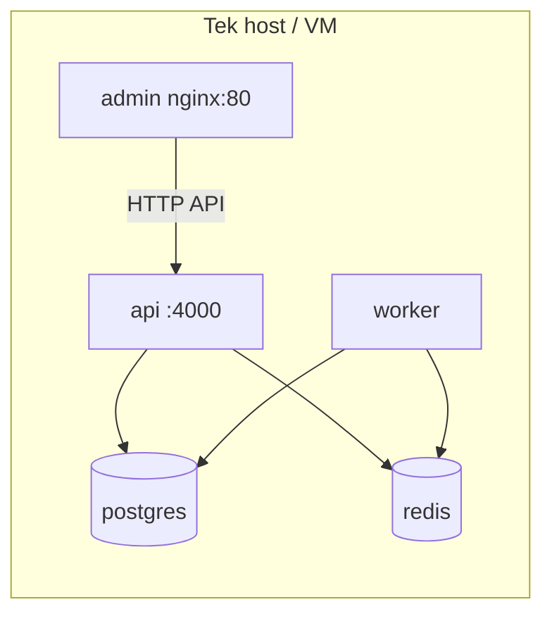

# Sprint 17 — CI/CD ve üretim hazırlığı

## Özet

Bu sprint; **güvenilir CI**, **Docker ile tekrarlanabilir imajlar**, **üretim Compose dosyası**, **sağlık/readiness uçları**, **duman testi**, **ortam şablonları** ve **dağıtım belgeleri** ekler. Kubernetes ve Terraform kapsam dışıdır.

## Mimari (Docker)

- **API**: Çok aşamalı build → `pnpm deploy --filter=@modern-cms/api` ile üretim `node_modules` (devDependency’siz çalışma zamanı), `dist/main.js`.
- **Admin**: Node build → nginx alpine ile statik dosyalar.
- **Worker**: Aynı deploy deseni; `worker:heartbeat` anahtarı Redis’te TTL ile tutulur.

## Yerel vs üretim

| Konu | Yerel | Üretim (`docker-compose.prod.yml`) |
|------|--------|-------------------------------------|
| Ortam dosyası | `.env`, `apps/*/.env` | `.env.production` |
| DB/Redis portu | Genelde host’a map | Sadece internal (`expose`) |
| CORS | Geliştirmede gevşek olabilir | `CORS_ORIGINS` daraltılmalı |
| Admin API URL | `VITE_API_URL` localhost | Gerçek public API URL |

## CI akışı (`.github/workflows/ci.yml`)

1. `pnpm install --frozen-lockfile`
2. `prisma validate`
3. `prisma migrate deploy` (hizmet konteyneri Postgres)
4. `pnpm typecheck` → `pnpm build`
5. `tsx src/smoke-di.ts` (Nest modül grafiği + Prisma bağlantısı)
6. `docker compose … config` (dev + prod örnek env ile sözdizimi)

## Docker workflow (`.github/workflows/docker.yml`)

- API, admin, worker imajlarını **push etmeden** derler.
- Compose dosyalarını doğrular.
- `main` ve `infra/docker/**` yollarında tetiklenir (ayrıca `workflow_dispatch`).

## Ortam stratejisi

- **Zorunlu (üretim)**: `JWT_SECRET` (≥32), `DATABASE_URL`, `REDIS_URL`
- **Admin build**: `VITE_API_URL` (tarayıcıdan erişilen API kökü)
- Şablonlar: `.env.example`, `apps/api/.env.example`, `apps/admin/.env.example`, `apps/worker/.env.example`, `.env.production.example`

## Sağlık uçları

- **`/health`**: DB, Redis, worker heartbeat (Redis’ten), uptime, `APP_VERSION` / `APP_GIT_SHA` / `APP_BUILD_TIME`
- **`/health/ready`**: DB zorunlu; `REDIS_URL` tanımlıysa Redis zorunlu — aksi halde **503**
- **`/version`**: Hafif metadata (JWT gerektirmez)

## Duman testi

`infra/scripts/smoke-prod.sh`:

- `/health`, `/health/ready`, `/version`
- Login → `/auth/me`
- `x-tenant-id` ile `/public/site-config` (tenant id `/auth/me` içinden veya `SMOKE_TENANT_ID`)

Çalıştırma: `pnpm smoke:prod` veya scripti doğrudan bash ile çağırın.

## Yayın (release) akışı önerisi

1. CI yeşil (PR merge öncesi).
2. Sürüm etiketi / `APP_VERSION` build arg güncellemesi.
3. İmajları derle ve registry’ye it (bu repoda registry push yok — pipeline’ınıza ekleyin).
4. Hedef ortamda `migrate deploy`, ardından `compose up -d`.
5. `pnpm smoke:prod` veya sağlık uçları ile doğrulama.

## Üretim kontrol listesi

- [ ] `JWT_SECRET`, DB ve Redis parolaları güçlü ve benzersiz
- [ ] `CORS_ORIGINS` üretim domain’leriyle sınırlı
- [ ] `VITE_API_URL` doğru public API adresi
- [ ] Migrasyonlar uygulandı (`prisma migrate deploy`)
- [ ] Yedekleme (Postgres volume / snapshot) tanımlı
- [ ] İzleme ve log toplama (ileride Pino/Winston veya harici ajan)

## Varsayımlar

- Tek host Compose; yük dengeleyici ve TLS terminasyonu host dışında (ör. reverse proxy) eklenebilir.
- Worker, API’ye HTTP ile bağlanmaz; yalnızca Postgres + Redis kullanır.
- Prisma client, API ve worker build sırasında aynı şema ile üretilir.
